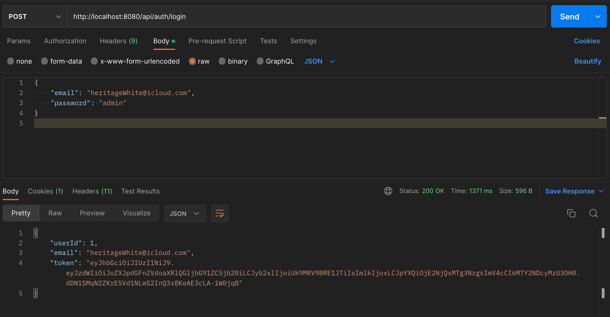
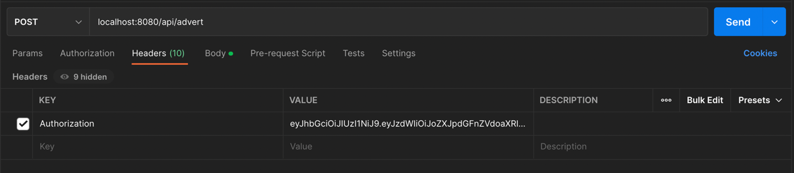

 
# ADDA [Back-end]
The idea of the project is to launch an online advertising platform that brings people together to buy, sell or exchange goods and services.

### Required to install
- Java 17
- PostgreSQL

### How to run

Before we start, you need to open PSQL Terminal and create a DB,

You can achieve it with these commands
```
CREATE DATABASE adda;
```

The server runs on 8080 port (By default), but if you have any conflicts, you can change it here too.
Username and password for the DB you can configure while creating database.
```
#application.properties
server.port = 8080

spring.datasource.url=jdbc:postgresql://localhost:5432/adda
spring.datasource.username=postgres
spring.datasource.password=421970
```

Then, you need to register on the imgbb.com to get a free photo hosting ApiKey. 

[Here is the link](https://api.imgbb.com/) (https://api.imgbb.com/)

```
# "Put here your api key"
api.key = 4bcf051e1603553d4218e2cea8b00555
```

Finally, you need to connect smtp server. You can use Gmail service for it.

🚀 Notice! Since May 30, 2022, Google no longer supports the use of third-party apps, so you need to generate 'app password' in your account instead of using your private password
```
# Email
spring.mail.host=smtp.gmail.com
spring.mail.port=587
spring.mail.username=example_gmail@gmail.com
spring.mail.password=app_password_which_you_created
spring.mail.properties.mail.smtp.auth=true
spring.mail.properties.mail.smtp.starttls.enable=true
```

## Run it
That's all, you need to run Application class in your IDE.
```java
@SpringBootApplication
@EnableSwagger2
public class AddaApplication {
    //...
}
```

The project is already include all pre-data you need to test the application,
so you could avoid creating adverts or users to work with.

#### Database

There are two users in our database

| Id  | Username  | Password | Email             | Role  |
|:----|:----------|:---------|:------------------|:------|
| `1` | `Admin`   | `1`      | `admin@gmail.com` | Admin |
| `1` | `User`    | `1`      | `user@gmail.com`  | User  |

Also, there are 3 adverts in our database

| UUID                                  | Title           | Category      |
|:--------------------------------------|:----------------|:--------------|
| `f96401d2-7f63-4891-aafb-0608919b2a03`| `BMW M5`        | `Car`         |
| `f96401d2-7f63-4891-aafb-0608919b2a04`| `Iphone 12 PRO` | `Electronic`  |
| `f96401d2-7f63-4891-aafb-0608919b2a05`| `House in Kiev` | `Real Estate` |


### Congratulations

Congratulations! You've done everything correct 🎉

### 🚀 Before
"I would recommend you to download PostMan, so then you can feel better how it works. 
However, you can use Swagger which is already included, it's up to you"

To enter into Swagger: `http://localhost:8080/swagger-ui/index.html`
###  🌿 Start
Let's try to send some requests, but we need a JWT token to do it;

`http://localhost:8080/api/auth/login`
```
{
    "email": "heritageWhite@icloud.com",
    "password": "admin"
}
```


---
Furthermore, we can get the adverts in the next format;

`/api/advert/all?pageNumber=1&pageSize=1`
```
{
    "content": [
        {
            "id": "f96401d2-7f63-4891-aafb-0608919b2a05",
            "title": "House in Kiev",
            "price": "100350",
            "description": "4-room apartment",
            "email": "heritageWhite@icloud.com",
            "username": "Heritage",
            "date": "26-09-2022",
            "viewers": 120,
            "qrCode": "https://i.ibb.co/GQZXmb3/qr-code-f96401d2-7f63-4891-aafb-0608919b2a03.png",
            "photos": [],
            "category": "Real Estate"
        }
    ],
    "pageable": {
        "sort": {
            "empty": false,
            "unsorted": false,
            "sorted": true
        },
        "offset": 1,
        "pageNumber": 1,
        "pageSize": 1,
        "paged": true,
        "unpaged": false
    },
    "totalPages": 3,
    "totalElements": 3,
    "last": false,
    "size": 1,
    "number": 1,
    "sort": {
        "empty": false,
        "unsorted": false,
        "sorted": true
    },
    "numberOfElements": 1,
    "first": false,
    "empty": false
}
```
---

Also, we can search with the title

`/api/advert/all?title=B` 
|| `/api/advert/all?pageNumber=0&pageSize=3&title=B`
```
"content": [
    {
      "id": "f96401d2-7f63-4891-aafb-0608919b2a03",
      "title": "BMW M5",
      "price": "67895",
      "description": "M-packet auto",
      "email": "heritageWhite@icloud.com",
      "username": "Heritage",
      "date": "26-09-2022",
      "viewers": 0,
      "qrCode": "https://i.ibb.co/GQZXmb3/qr-code-f96401d2-7f63-4891-aafb-0608919b2a03.png",
      "photos": [],
      "category": "Car"
    }
  ],
  ...
```
---
Some requests require a jwt token, 
to provide it you need to make a request with 'Authorization' header:

`http://localhost:8080/api/advert`


```
"content": [
    {
      "id": "f96401d2-7f63-4891-aafb-0608919b2a03",
      "title": "BMW M5",
      "price": "67895",
      "description": "M-packet auto",
      "email": "heritageWhite@icloud.com",
      "username": "Heritage",
      "date": "26-09-2022",
      "viewers": 0,
      "qrCode": "https://i.ibb.co/GQZXmb3/qr-code-f96401d2-7f63-4891-aafb-0608919b2a03.png",
      "photos": [],
      "category": "Car"
    }
  ],
  ...
```
The rest you can find in Swagger 

---
### Functionality

- Register and Authorization with JWT token
- Upload MultipartFiles of adverts to the hosting server
- WishList - is kind of favorite list, which is built on back-end
- Secure sensitive information with DTO representation
- Pagination, sorting and filtering the adverts
- Generation QR codes for each advert
- Role-based system
- Logging implementation
- Global Exception Handler implementation
- History of visiting
- URL shorter
- Email validation

### 🛠 Skills
Maven, Spring boot (Data, Security...), JUnit, PostgresQL, AWS, Heroku
