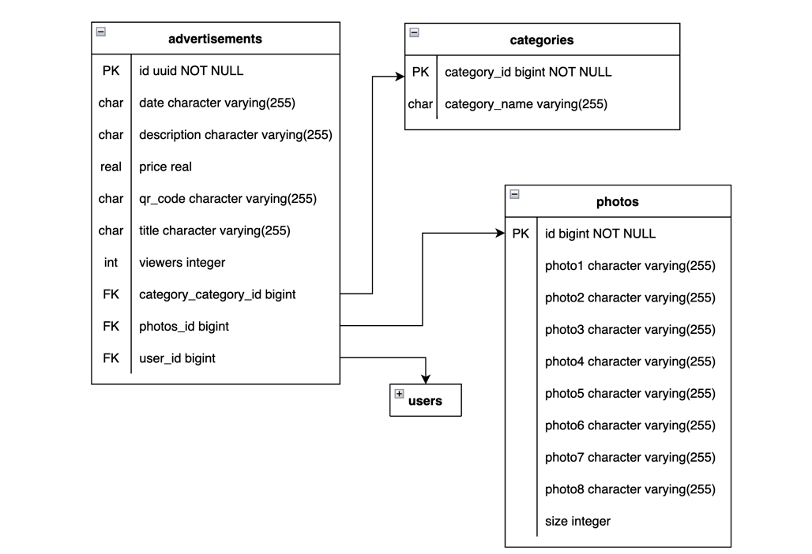

# ADDA [Back-end]

The idea of the project is to launch an online advertising platform that brings people together to buy, sell or exchange
goods and services.

### Required to install

- Java 17
- PostgreSQL

### How to run

Before we start, you need to open PSQL Terminal and create a DB,
You can achieve it with this command

```
CREATE DATABASE adda;
```

The server runs on 8080 port (By default), but if you have any conflicts, you can change it here too.
Username and password for the DB you can configure while creating database.

```
#application.properties
server.port = 8080

spring.datasource.url=jdbc:postgresql://localhost:5432/adda
spring.datasource.username=postgres
spring.datasource.password=421970
```

Then, you need to register on the imgbb.com to get a free photo hosting ApiKey.
[Here is the link](https://api.imgbb.com/) (https://api.imgbb.com/)

```
# "Put here your api key"
api.key = 4bcf051e1603553d4218e2cea8b00555
```

Finally, you need to connect smtp server and then you can use Gmail service for it.

### Notice ❗️

Notice! Since May 30, 2022, Google no longer supports the use of third-party apps, so you need to generate 'app
password' in your account instead of using your private password

```
# Email
spring.mail.host=smtp.gmail.com
spring.mail.port=587
spring.mail.username=example_gmail@gmail.com
spring.mail.password=app_password_which_you_created
spring.mail.properties.mail.smtp.auth=true
spring.mail.properties.mail.smtp.starttls.enable=true
```

## Run it

That's all, you need to run Application class in your IDE.

```java

@SpringBootApplication
@EnableSwagger2
public class AddaApplication {
    //...
}
```

The project is already include all pre-data you need to test the application,
so you could avoid creating adverts or users to work with.

#### Database

There are two users in our database

| Id  | First name | Username | Password | Email             | Role  | 
|:----|:-----------|:---------|:---------|:------------------|:------|
| `1` | `Tony`     | `Admin`  | `1`      | `admin@gmail.com` | Admin |          
| `2` | `Alex`     | `User`   | `1`      | `user@gmail.com`  | User  |          


Also, there are 3 adverts in our database

| UUID                                  | Title                   | Price     | Category       | 
|:--------------------------------------|:------------------------|:----------|:---------------|
| `46ef9821-5f1f-4927-a98f-1a94f71703eb`| `BMW F90`               | `90549.0` | `Car`          | 
| `e0bbdb63-8cbc-49aa-a442-b7ba6ca20e86`| `Iphone 12 mini 256 gb` | `670.0`   | `Electronics`  | 
| `73e0b7d7-0051-48d5-b263-3b9bccc20ddb`| `Lip gloss MaybeLine`   | `25.0`  | `Beauty`       | 



### Congratulations

Congratulations! You've done everything correct 🎉

### 🚀 Before

"I would recommend you to download PostMan, so then you can feel better how it works.
However, you can use Swagger which is already included, it's up to you"

To enter into Swagger: `http://localhost:8080/swagger-ui/index.html`

### 🌿 Start

Let's try to send some requests, but we need a JWT token to do it;

`http://localhost:8080/api/auth/login`

```
{
    "email": "heritageWhite@icloud.com",
    "password": "admin"
}
```


---
`[POST]: /api/advert`

Some requests require a jwt token,
to provide it you need to make a request with 'Authorization' header.
Then we can post our first advert to the system.

```
Advert: {
    "title": "MacBook Air",
    "category_id": "2",
    "price": 1500,
    "description": "MacBook Air with M2 is an incredibly portable laptop "
}
```


// *Authorization required*
---
Furthermore, we can get the adverts in the next format;

`[GET] /api/advert/v4/page?title&description&size=1&page&sortList=date, title`

```
{
    "_embedded": {
        "advertModelList": [
            {
                "id": "73e0b7d7-0051-48d5-b263-3b9bccc20ddb",
                "title": "Lip gloss MaybeLine",
                "price": 25.0,
                "description": "Decorate your everyday looks with charm and ease from the popular American brand Maybelline New York!",
                "email": "admin@gmail.com",
                "username": "Admin",
                "date": "21-11-2022",
                "viewers": 0,
                "photos": [],
                "category": "Beauty",
                "qr_code_link": "https://i.ibb.co/R3hsjb1/qr-code-73e0b7d7-0051-48d5-b263-3b9bccc20ddb.png"
            }
        ]
    },
    "_links": {
        "first": {
            "href": "http://localhost:8080/api/advert/v4/page?title&description&sortList=date,%20title&page=0&size=1&sort=date,title,desc"
        },
        "self": {
            "href": "http://localhost:8080/api/advert/v4/page?title&description&sortList=date,%20title&page=0&size=1&sort=date,title,desc"
        },
        "next": {
            "href": "http://localhost:8080/api/advert/v4/page?title&description&sortList=date,%20title&page=1&size=1&sort=date,title,desc"
        },
        "last": {
            "href": "http://localhost:8080/api/advert/v4/page?title&description&sortList=date,%20title&page=2&size=1&sort=date,title,desc"
        }
    },
    "page": {
        "size": 1,
        "totalElements": 3,
        "totalPages": 3,
        "number": 0
    }
}
```

---
To get user's adverts you can simply do the following

`[GET]: /api/advert/user/1`


---
And to update adverts you can simply

`[PUT]: /api/advert/{advertId}`


// *Authorization required*
---
`[POST]: /api/wishlist`

As a functionality allows us to create wishlist. Let's add an advert to the wishlist of user:


`[GET]: /api/wishlist`

Then let's check inside of the our wishlist:


// *Authorization required*

---
*The rest of the requests you can find in Swagger*

### Functionality

- Register and Authorization with JWT token (Update and Refresh tokens are included)
- Upload MultipartFiles of adverts to the hosting server
- WishList - is kind of favorite list, which is built on back-end, let us save adverts for the future
- Secure sensitive information with DTO representation
- Pagination, sorting and filtering the adverts and users in getting requests
- Generation QR codes for each advert
- Role-based secure system
- Live logging implementation
- Global Exception Handler implementation
- History of visiting adverts of every user
- URL shorter to improve user experience
- Email sender, it used to validating users while registration and sending general emails

### 🛠 Skills

Maven, Flyway, Spring boot (Data, Security..), JUnit, PostgresQL, AWS, Heroku

### Diagram

